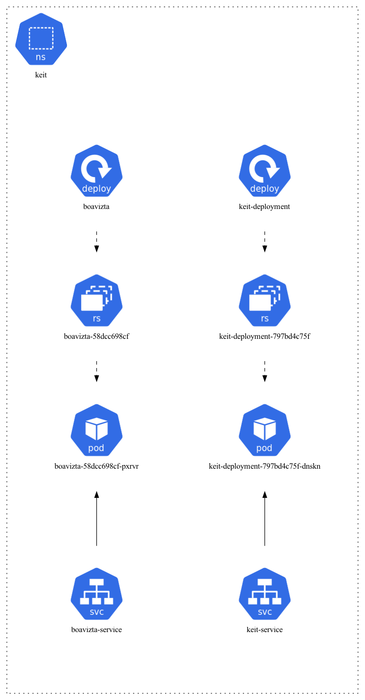
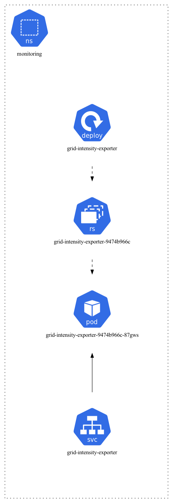
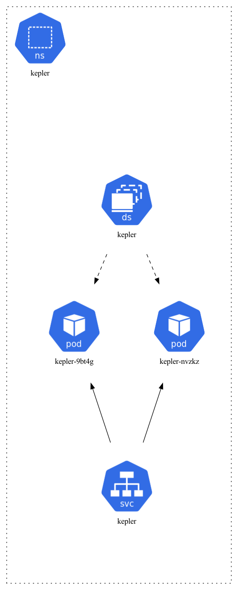
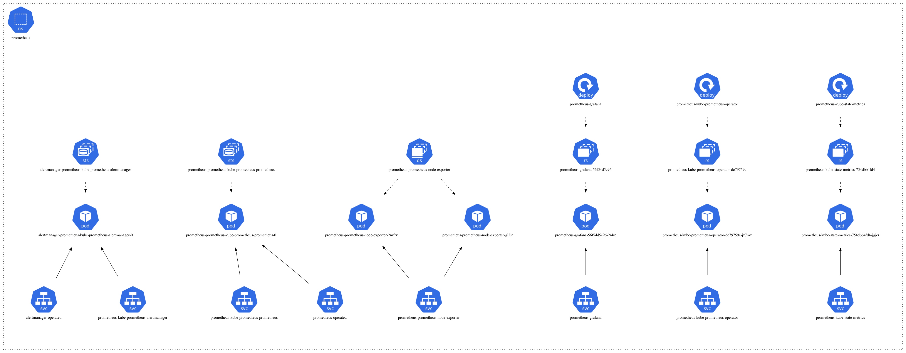

# eks

## create AWS EKS cluster

To create the EKS cluster, from the commandline:

```
eksctl create cluster -f cluster-config.yaml
```

***

## Build keit:

```
go mod init keit
go mod tidy

go build -o keit .   

CGO_ENABLED=0 GOOS=linux go build -o keit .
docker build -t keit .
```

With docker images, you will find the new keit image. now tag it and push it to ecr.

```
docker tag keit 623566434957.dkr.ecr.eu-west-1.amazonaws.com/keit:latest
aws ecr get-login-password --region eu-west-1 | docker login --username AWS --password-stdin 623566434957.dkr.ecr.eu-west-1.amazonaws.com
docker push 623566434957.dkr.ecr.eu-west-1.amazonaws.com/keit:latest
```

Other option is to store it in github packages of aknostic (probably we will remove ecr 20241213):

```
docker tag keit ghcr.io/aknostic/keit:<version>
CR_PAT=<your github token> 
echo $CR_PAT | docker login ghcr.io -u USERNAME --password-stdin
docker push ghcr.io/aknostic/keit:<version>
docker logout

(set latest to just added version, if needed)
```

Note: Classic github token, needs presmissions on: All repo + write packages + delete.&#x20;

***

## Deploy boavizta:

via deployment

```
kubectl create namespace keit
kubectl apply -f deployment_boavizta.yaml
```

This local pod is used by keit to get the embodied carbon of the servers

***

## Deploy keit:

Get the pod to run in the cluster:

```
kubectl apply -f keit_deployment.yaml
kubectl apply -f keit_service.yaml
kubectl apply -f keit_servicemonitor.yaml
```

Add the role bindings otherwise we the keit.go does not have access to readout all the pods on and all the nodes (runs only in keit namespace):

for the pods:

```
kubectl apply -f clusterrole.yaml
kubectl apply -f clusterrolebinding.yaml
```

for the nodes:

```
kubectl apply -f clusterrole-node-reader.yaml
kubectl apply -f clusterrolebinding-node-reader.yaml
```

***

## Usage, examples:

Grafana:

```
kubectl -n prometheus port-forward svc/prometheus-grafana 3000:80 &
```

[http://127.0.0.1:3000](http://127.0.0.1:3000)

Check in browser, username, password. Look for the dashboard **Carbon intensity EKS - KEIT (Ierland)** if not there import the file KEIT\_grafana\_dashboard.json into grafana.

Prometheus:

```
kubectl -n prometheus port-forward svc/prometheus-operated 9090 &
```

[http://127.0.0.1:9090](http://127.0.0.1:9090)

check the keit metrics, embodied/embedded value of instances.

```
kubectl -n keit port-forward service/keit-service 8080:8080 &
curl -s http://localhost:8080/metrics
```

***

## Keit



## grid-intensity



## Kepler



## prometheus


